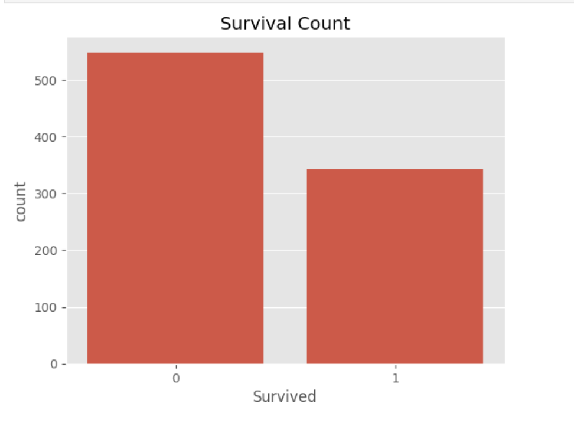
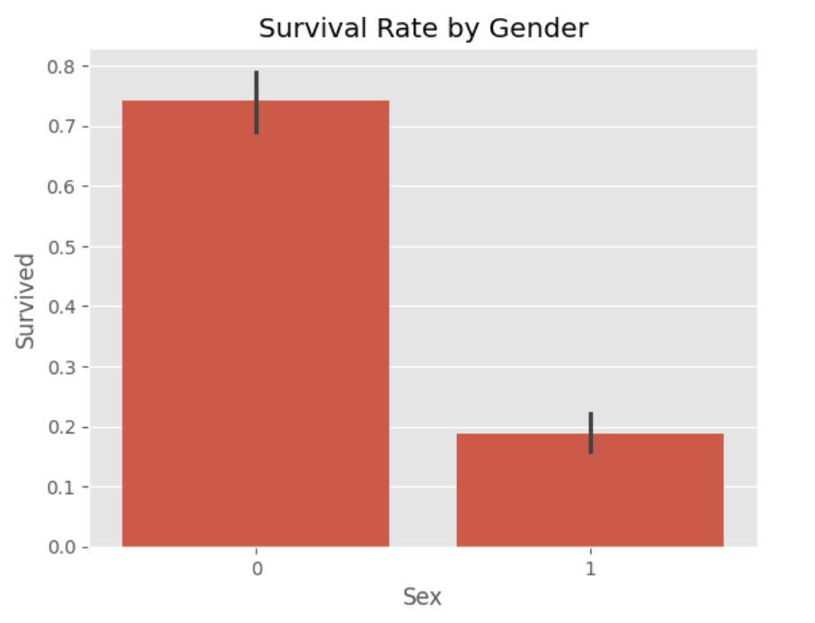
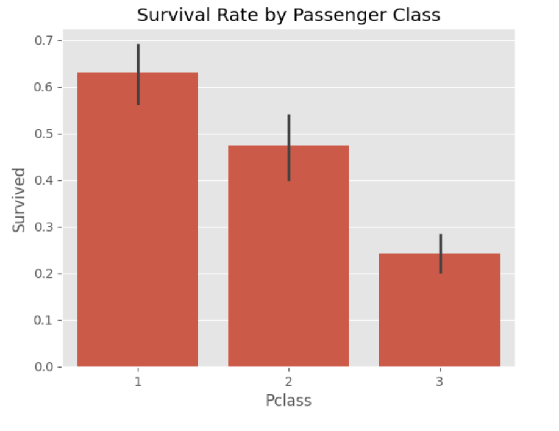
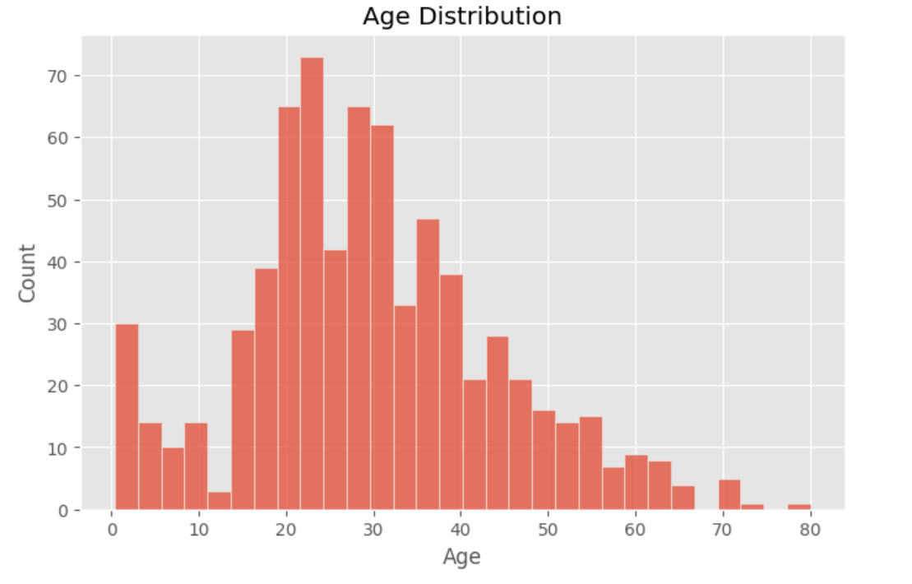
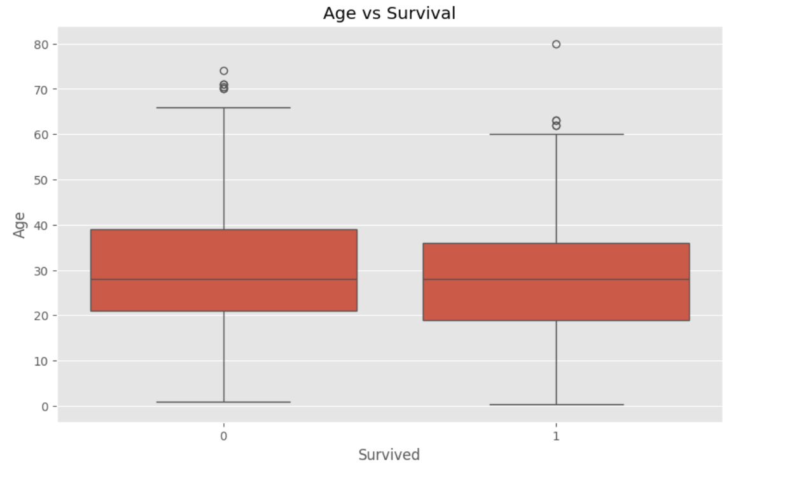
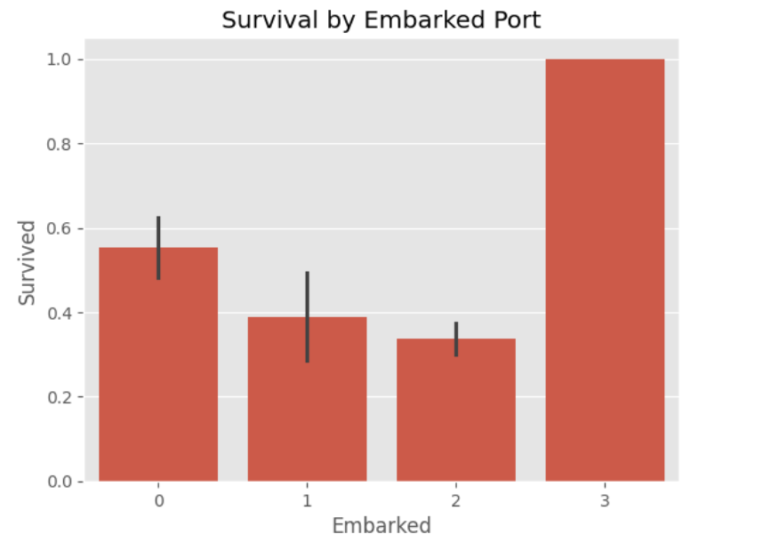
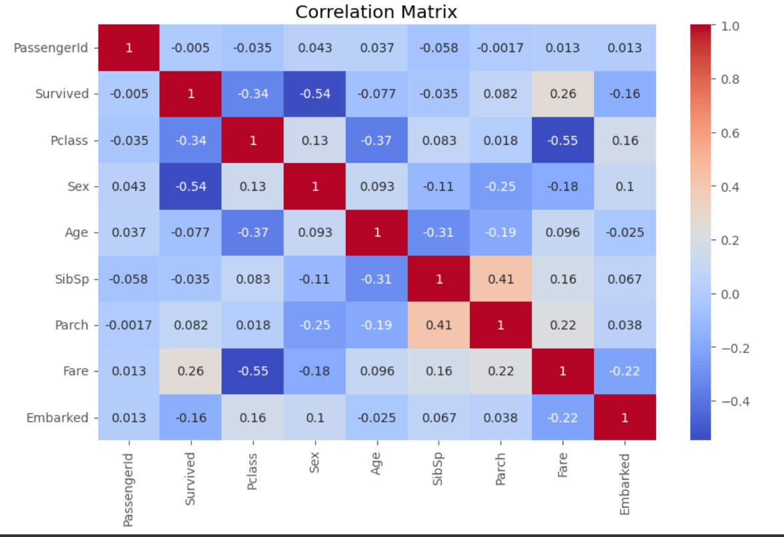

# Titanic Survival Analysis [Codemetric Task-1]

A comprehensive data analysis internship task exploring passenger survival patterns on the RMS Titanic. This project utilizes the famous Titanic dataset to uncover insights about survival factors through exploratory data analysis (EDA) and visualization.

##  Project Overview

This analysis examines the Titanic passenger data to understand what factors influenced survival outcomes. The project includes data cleaning, exploratory analysis, and multiple visualizations to identify survival patterns across different passenger demographics.

##  Dataset

The project uses three datasets from the Kaggle Titanic competition:

- **train.csv** (891 records): Training dataset with passenger information and survival outcomes
- **test.csv** (418 records): Test dataset for predictions (without survival labels)
- **gender_submission.csv**: Sample submission format for predictions

### Features in the Dataset:
- `PassengerId`: Unique identifier for each passenger
- `Survived`: Binary target (0 = Did not survive, 1 = Survived)
- `Pclass`: Passenger class (1st, 2nd, 3rd)
- `Name`: Passenger name
- `Sex`: Passenger gender
- `Age`: Passenger age in years
- `SibSp`: Number of siblings/spouses aboard
- `Parch`: Number of parents/children aboard
- `Ticket`: Ticket number
- `Fare`: Ticket fare paid
- `Cabin`: Cabin number
- `Embarked`: Port of embarkation (C = Cherbourg, Q = Queenstown, S = Southampton)

##  Analysis Workflow

### 1. Data Exploration
- Load and inspect dataset structure
- Generate descriptive statistics
- Identify missing values and data types

### 2. Data Cleaning
- Fill missing `Age` values using median imputation
- Fill missing `Embarked` values using mode imputation
- Drop `Cabin` column due to excessive missing values

### 3. Data Preprocessing
- Encode categorical variables (`Sex`, `Embarked`) using LabelEncoder
- Prepare data for analysis and visualization

### 4. Exploratory Data Analysis & Visualization
Generate key visualizations to uncover survival patterns:

##  Visualizations


**Survival Count**: Overall distribution of survivors vs. non-survivors


**Survival by Gender**: Female passengers had significantly higher survival rates


**Survival by Passenger Class**: 1st class passengers had much higher survival rates


**Age Distribution**: Most passengers were between 20-40 years old


**Age vs Survival**: Younger passengers, especially children, had better survival chances


**Survival by Embarked Port**: Survival rates varied by port of embarkation


**Correlation Matrix**: Heatmap showing relationships between numeric variables

##  Key Findings

1. **Gender Bias**: Females had significantly higher survival rates (74%) compared to males (19%)
2. **Class Matters**: 1st class passengers had the highest survival rate (~62%), while 3rd class had the lowest (~24%)
3. **Age Factor**: Younger passengers, especially children, had better survival chances
4. **Price Correlation**: Higher ticket fares correlated with better survival rates
5. **Port of Origin**: Passengers embarking from Cherbourg had slightly higher survival rates

##  Project Structure

```
Titanic-Survival-Analysis/
│
├── data/
│   ├── train.csv              # Training dataset (891 records)
│   ├── test.csv               # Test dataset (418 records)
│   └── gender_submission.csv  # Sample submission format
│
├── notebooks/
│   └── Titanic_Survival_Analysis.ipynb  # Main analysis notebook
│
├── images/
│   ├── Survival_Count.png
│   ├── Survival_By_Gender.png
│   ├── Survival_Rate_By_Passanger_Class.png
│   ├── Age_Distribution.png
│   ├── Age_vs_Survival.png
│   ├── Survival_By_Embarked_Port.png
│   └── Correlation_Matrix.png
│
├── report/
│   └── Titanic_Report.pdf      # Detailed analysis report
│
├── requirements.txt             # Python dependencies
├── README.md                    # This file
├── .gitignore                   # Git ignore rules
               
```

##  Getting Started

### Prerequisites
- Python 3.8+
- pip or conda

### Installation

1. Clone the repository:
```bash
git clone https://github.com/yourusername/Titanic-Survival-Analysis.git
cd Titanic-Survival-Analysis
```

2. Create a virtual environment:
```bash
python -m venv venv
source venv/bin/activate  # On Windows: venv\Scripts\activate
```

3. Install dependencies:
```bash
pip install -r requirements.txt
```

### Usage

Run the analysis notebook:
```bash
jupyter notebook notebooks/Titanic_Survival_Analysis.ipynb
```

Or using JupyterLab:
```bash
jupyter lab notebooks/Titanic_Survival_Analysis.ipynb
```

##  Dependencies

- `pandas`: Data manipulation and analysis
- `numpy`: Numerical computing
- `matplotlib`: Data visualization
- `seaborn`: Statistical data visualization
- `scikit-learn`: Machine learning preprocessing tools
- `jupyter`: Interactive notebook environment

All dependencies are listed in `requirements.txt`.

##  Notes

- Missing `Age` values were imputed using the median age
- Missing `Embarked` values were filled using the mode (most frequent value)
- The `Cabin` column was removed due to >77% missing values
- Categorical variables were label-encoded for numerical analysis

##  Data Source

The dataset is from the [Kaggle Titanic competition](https://www.kaggle.com/c/titanic).

##  Author

**Allen John Isac**  
Created as a Data Science Internship Task.

##  Contributing

Contributions are welcome! Feel free to submit pull requests or open issues for bugs and feature requests.
